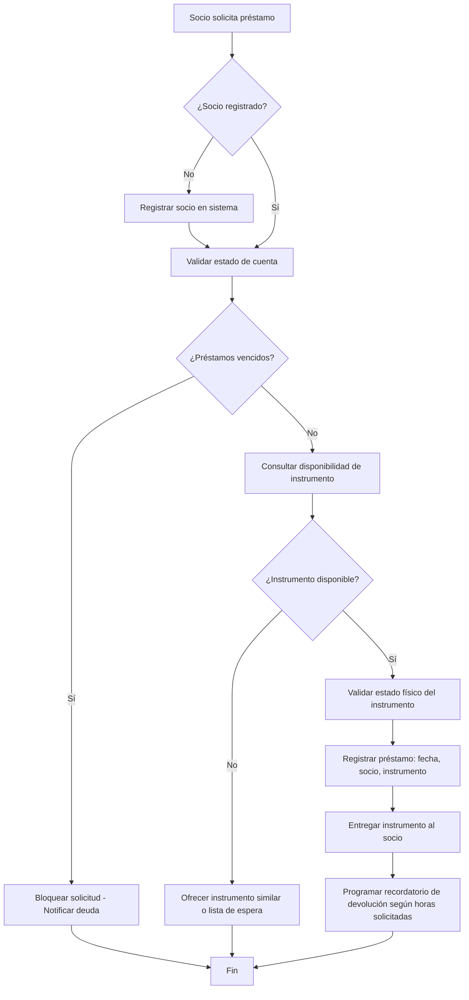
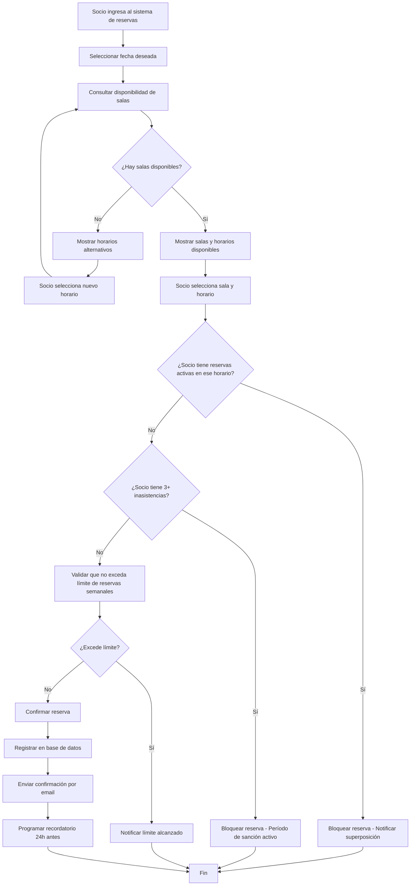
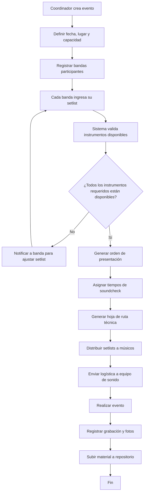
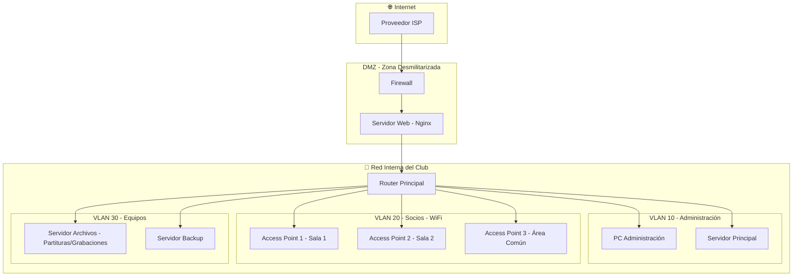
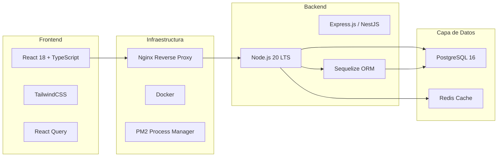
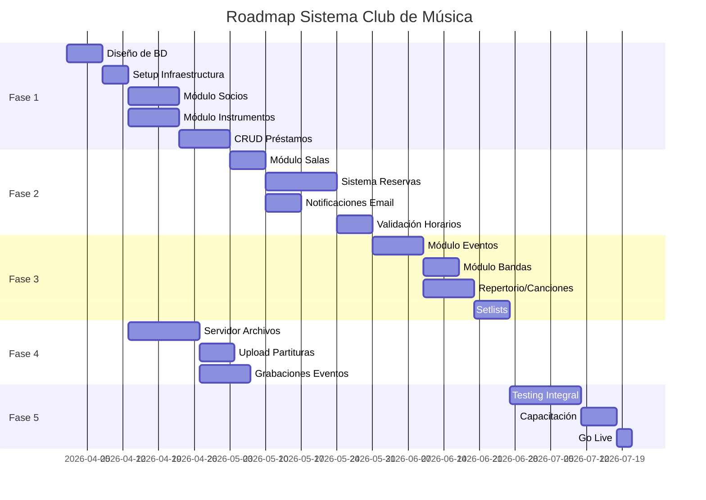

# Arquitectura Empresarial - Sistema Club de Música

**Autores:** Juan Sandoval, Braulio Silva, Javier Herrada  
**Fecha:** Abril 2026  
**Versión:** 1.0

---

## 1. Análisis de Requerimientos

### 1.1 Requerimientos Funcionales

#### RF-01: Gestión de Préstamos de Instrumentos
| ID | Descripción |
|----|-------------|
| RF-01.1 | Registrar socio con nivel de habilidad e instrumento principal |
| RF-01.2 | Consultar disponibilidad de instrumentos en tiempo real |
| RF-01.3 | Registrar préstamo de instrumento exclusivo para eventos dentro de la universidad (duración por horas) |
| RF-01.4 | Especificar en la solicitud online el documento físico a entregar como garantía (ej. Cédula de Identidad) |
| RF-01.5 | Checkbox obligatorio para aceptar términos y condiciones de responsabilidad del instrumento |
| RF-01.6 | Registrar devolución de instrumento con validación de estado |
| RF-01.7 | Notificar vencimiento de préstamo |
| RF-01.8 | Generar reporte de historial de préstamos por socio |
| RF-01.9 | Bloquear socio con préstamos vencidos o instrumentos dañados |

#### RF-02: Reservas de Salas de Ensayo
| ID | Descripción |
|----|-------------|
| RF-02.1 | Consultar disponibilidad de salas por fecha y hora |
| RF-02.2 | Reservar sala con validación de no superposición de horarios |
| RF-02.3 | Checkbox obligatorio para aceptar términos y condiciones de uso de la sala |
| RF-02.4 | Cancelar reserva con liberación automática del horario |
| RF-02.5 | Validar que socio no tenga reservas activas superpuestas |
| RF-02.6 | Permitir reservas recurrentes (semanales/mensuales) |
| RF-02.7 | Notificar recordatorio de reserva 24 horas antes |
| RF-02.8 | Registrar inasistencia y aplicar penalización (3 faltas = bloqueo 30 días) |

#### RF-03: Gestión de Setlists para Eventos
| ID | Descripción |
|----|-------------|
| RF-03.1 | Crear evento con fecha, lugar y banda participante |
| RF-03.2 | Asignar repertorio de canciones a cada evento |
| RF-03.3 | Definir orden de presentación (setlist) |
| RF-03.4 | Asignar instrumentos requeridos por canción |
| RF-03.5 | Generar hoja de ruta logística (sonido, iluminación, backline) |
| RF-03.6 | Consultar setlist desde dispositivo móvil el día del evento |
| RF-03.7 | Registrar grabación del evento y asociar a partituras |

### 1.2 Requerimientos No Funcionales

| ID | Descripción |
|----|-------------|
| RNF-01 | Tiempo de respuesta < 2 segundos para consultas de disponibilidad |
| RNF-02 | Soporte para 500 usuarios concurrentes |
| RNF-03 | Disponibilidad 99.5% en horario de ensayos (8:00 - 22:00) |
| RNF-04 | Backup automático de base de datos cada 24 horas |
| RNF-05 | Diseño responsive para acceso móvil |
| RNF-06 | API RESTful documentada con OpenAPI/Swagger |

### 1.3 Requerimientos No Funcionales de Seguridad

| ID | Descripción |
|----|-------------|
| SEG-01 | Autenticación segura con hash de contraseñas utilizando salt (ej. bcrypt, Argon2) en la base de datos |
| SEG-02 | Uso estricto de HTTPS (TLS 1.2 o superior) para cifrar datos en tránsito entre cliente y servidor |
| SEG-03 | Protección contra inyección SQL mediante el uso de consultas preparadas o un ORM seguro |
| SEG-04 | Prevención de ataques Cross-Site Scripting (XSS) sanitizando todas las entradas del usuario y salidas al navegador |
| SEG-05 | Implementación de tokens JWT con firmas criptográficas seguras y tiempos de expiración cortos para sesiones |
| SEG-06 | Mitigación de fuerza bruta en endpoints de login mediante Rate Limiting (ej. bloqueo tras 5 intentos fallidos) |
| SEG-07 | Auditoría de acciones críticas y registros de seguridad almacenados de manera inmutable (Logs_Auditoria) |
| SEG-08 | Configuración de cabeceras de seguridad HTTP (CORS estricto, Content-Security-Policy, X-Frame-Options) |

---

## 2. Arquitectura de Negocio (BPMN)

### 2.1 Flujo de Préstamo de Instrumento

### 2.2 Flujo de Reserva de Sala de Ensayo

### 2.3 Flujo de Gestión de Evento Musical

---

## 3. Arquitectura de Datos (ERD)

### 3.1 Modelo Entidad-Relación

```mermaid
erDiagram
    SOCIO {
        int id PK
        string nombre
        string email UK
        string telefono
        string instrumento_principal
        string nivel_habilidad
        date fecha_registro
        string estado "ACTIVO|BLOQUEADO"
    }

    INSTRUMENTO {
        int id PK
        string nombre
        string tipo "GUITARRA|BAJO|AMPLIFICADOR|BATERIA|OTRO"
        string marca
        string modelo
        string numero_serie
        date fecha_adquisicion
        string estado "DISPONIBLE|PRESTADO|MANTENIMIENTO|BAJA"
        string ubicacion
    }

    PRESTAMO {
        int id PK
        int socio_id FK
        int instrumento_id FK
        date fecha_salida
        date fecha_devolucion
        date fecha_limite
        string estado "ACTIVO|DEVUELTO|VENCIDO"
        string observaciones
    }

    SALA {
        int id PK
        string nombre
        string tipo "CUBICULO|SALON_ACUSTICO|ESTUDIO"
        int capacidad
        string equipamiento
        string estado "ACTIVA|MANTENIMIENTO|INACTIVA"
    }

    RESERVA {
        int id PK
        int socio_id FK
        int sala_id FK
        datetime fecha_inicio
        datetime fecha_fin
        string estado "CONFIRMADA|CANCELADA|COMPLETADA|INASISTENCIA"
        datetime fecha_creacion
        string observaciones
    }

    EVENTO {
        int id PK
        string nombre
        datetime fecha
        string lugar
        string descripcion
        string estado "PLANIFICADO|EN_PROGRESO|FINALIZADO|CANCELADO"
        datetime fecha_creacion
    }

    BANDA {
        int id PK
        string nombre
        string genero
        int lider_id FK
        datetime fecha_formacion
    }

    BANDA_SOCIO {
        int banda_id FK
        int socio_id FK
        string rol "INTEGRANTE|FUNDADOR"
    }

    CANCION {
        int id PK
        string titulo
        string artista
        string genero
        int duracion_segundos
        string tonalidad
        string partitura_url
        string grabacion_url
    }

    SETLIST {
        int id PK
        int evento_id FK
        int banda_id FK
        int cancion_id FK
        int orden
        string notas
    }

    INSTRUMENTO_REQUERIDO {
        int id PK
        int cancion_id FK
        string tipo_instrumento
        string especificaciones
    }

    SOCIO ||--o{ PRESTAMO : "realiza"
    SOCIO ||--o{ RESERVA : "reserva"
    SOCIO ||--o{ BANDA_SOCIO : "pertenece"
    INSTRUMENTO ||--o{ PRESTAMO : "es prestado"
    SALA ||--o{ RESERVA : "es reservada"
    BANDA ||--o{ BANDA_SOCIO : "contiene"
    BANDA ||--o{ SETLIST : "presenta"
    EVENTO ||--o{ SETLIST : "incluye"
    CANCION ||--o{ SETLIST : "contiene"
    CANCION ||--o{ INSTRUMENTO_REQUERIDO : "requiere"
```

### 3.2 Diccionario de Datos

| Entidad | Descripción | Reglas de Negocio |
|---------|-------------|-------------------|
| SOCIO | Miembro registrado del club | Único por email, estado bloqueado impide nuevas operaciones |
| INSTRUMENTO | Activo físico del club | Solo disponible si estado = DISPONIBLE |
| PRESTAMO | Transacción de préstamo | Solo para eventos dentro de la universidad, máximo en horas |
| SALA | Espacio físico de ensayo | Capacidad define máximo de ocupantes |
| RESERVA | Reserva de horario | No superposición, máximo 3 reservas/semana por socio |
| EVENTO | Presentación musical | Puede tener múltiples bandas |
| BANDA | Agrupación de socios | Requiere al menos 1 fundador |
| CANCION | Pieza musical del repertorio | Puede estar en múltiples setlists |
| SETLIST | Lista de canciones para evento | Orden definido por banda |

---

## 4. Arquitectura Tecnológica

### 4.1 Diseño de Red Local

### 4.2 Especificación de Infraestructura

#### 4.2.1 Servidor Principal
| Componente | Especificación |
|------------|----------------|
| CPU | Intel Xeon E-2336 o AMD Ryzen 7 PRO |
| RAM | 32 GB DDR4 ECC |
| Almacenamiento | 2x 1TB NVMe SSD (RAID 1) |
| SO | Ubuntu Server 24.04 LTS |
| Servicios | PostgreSQL, Node.js, Nginx, Redis |

#### 4.2.2 Servidor de Archivos (NAS)
| Componente | Especificación |
|------------|----------------|
| CPU | Intel Core i5 o equivalente |
| RAM | 16 GB |
| Almacenamiento | 4x 4TB HDD (RAID 5) = 12TB útiles |
| SO | TrueNAS Core o OpenMediaVault |
| Servicios | SMB/CIFS, FTP, WebDAV |

#### 4.2.3 Red WiFi para Socios
| Componente | Cantidad | Especificación |
|------------|----------|----------------|
| Access Points | 3-5 | Ubiquiti UniFi 6 LR o Aruba Instant On |
| Switch Principal | 1 | 24 puertos Gigabit PoE+ |
| Switch Secundario | 1 | 8 puertos Gigabit (sala remota) |
| Router | 1 | Mikrotik RB4011 o Ubiquiti EdgeRouter |
| Firewall | 1 | pfSense o firewall integrado en router |

#### 4.2.4 Segmentación de Red
| VLAN | ID | Rango IP | Propósito |
|------|-----|----------|-----------|
| Administración | 10 | 192.168.10.0/24 | Servidores, PC administración |
| Socios WiFi | 20 | 192.168.20.0/24 | Dispositivos de socios |
| Equipos | 30 | 192.168.30.0/24 | NAS, Backup, impresoras |
| Invitados | 40 | 192.168.40.0/24 | WiFi eventos públicos |

### 4.3 Stack Tecnológico

---

## 5. Roadmap de Implementación

### 5.1 Fases del Proyecto

### 5.2 Detalle por Fase

#### Fase 1: Miembros e Instrumentos (Sprint 1-3)
| Entregable | Descripción | Prioridad |
|------------|-------------|-----------|
| Esquema de BD | Tablas: socio, instrumento, préstamo | Alta |
| API Socios | CRUD completo con validación de emails únicos | Alta |
| API Instrumentos | CRUD con control de estado y ubicación | Alta |
| API Préstamos | Alta, devolución, consulta de historial | Alta |
| Frontend Básico | Dashboard, listado de socios e instrumentos | Alta |

#### Fase 2: Reservas de Salas (Sprint 4-6)
| Entregable | Descripción | Prioridad |
|------------|-------------|-----------|
| Tablas Salas/Reservas | Modelo con validación de superposición | Alta |
| API Reservas | Crear, cancelar, consultar disponibilidad | Alta |
| Algoritmo Disponibilidad | Validación de no superposición de horarios | Alta |
| Notificaciones | Email de confirmación y recordatorio | Media |
| Calendario UI | Vista semanal/mensual de reservas | Media |

#### Fase 3: Eventos y Setlists (Sprint 7-9)
| Entregable | Descripción | Prioridad |
|------------|-------------|-----------|
| Módulo Eventos | CRUD de eventos con fechas y lugares | Alta |
| Módulo Bandas | Gestión de integrantes y roles | Media |
| Repertorio | Catálogo de canciones con metadatos | Media |
| Setlists | Asignación de canciones a eventos con orden | Alta |
| Vista Móvil | Consulta de setlist desde celular | Baja |

#### Fase 4: Servidor de Archivos (Sprint 10-11)
| Entregable | Descripción | Prioridad |
|------------|-------------|-----------|
| Configuración NAS | Montaje de servidor de archivos | Alta |
| Upload Partituras | Interfaz para subir y asociar partituras | Media |
| Grabaciones | Almacenamiento y vinculación con eventos | Media |
| Permisos de Acceso | Control de lectura/escritura por rol | Media |

#### Fase 5: Testing y Despliegue (Sprint 12-14)
| Entregable | Descripción | Prioridad |
|------------|-------------|-----------|
| Tests Unitarios | Cobertura > 80% en backend | Alta |
| Tests Integración | Flujos completos de préstamo y reserva | Alta |
| Documentación | Manual de usuario y API docs | Alta |
| Capacitación | Sesiones con administradores y socios | Alta |
| Go Live | Puesta en producción | Crítica |

### 5.3 Cronograma Estimado

| Fase | Duración | Fecha Inicio | Fecha Fin |
|------|----------|--------------|-----------|
| Fase 1 | 5 semanas | 01-Abr-2026 | 05-May-2026 |
| Fase 2 | 4 semanas | 06-May-2026 | 02-Jun-2026 |
| Fase 3 | 4 semanas | 03-Jun-2026 | 30-Jun-2026 |
| Fase 4 | 2 semanas | 01-Jul-2026 | 14-Jul-2026 |
| Fase 5 | 3 semanas | 15-Jul-2026 | 04-Ago-2026 |

**Duración Total Estimada:** 18 semanas (~4.5 meses)

---

## 6. Apéndices

### 6.1 Glosario de Términos

| Término | Definición |
|---------|------------|
| Setlist | Lista ordenada de canciones para una presentación |
| Soundcheck | Prueba de sonido previa al evento |
| Backline | Equipamiento instrumental provisto en el escenario |
| Cubículo | Sala pequeña de ensayo individual (1-3 personas) |
| Salón Acústico | Sala grande para bandas completas (4-8 personas) |

### 6.2 Referencias

- Clean Architecture - Robert C. Martin
- BPMN 2.0 Specification - Object Management Group
- PostgreSQL 16 Documentation
- NestJS Framework Documentation

---

*Documento generado para la asignatura de Ingeniería Empresarial*  
*Universidad - Plataforma Club de Música*

*Ingeniero DenDennys Mauricio Coronel Vallejo*
