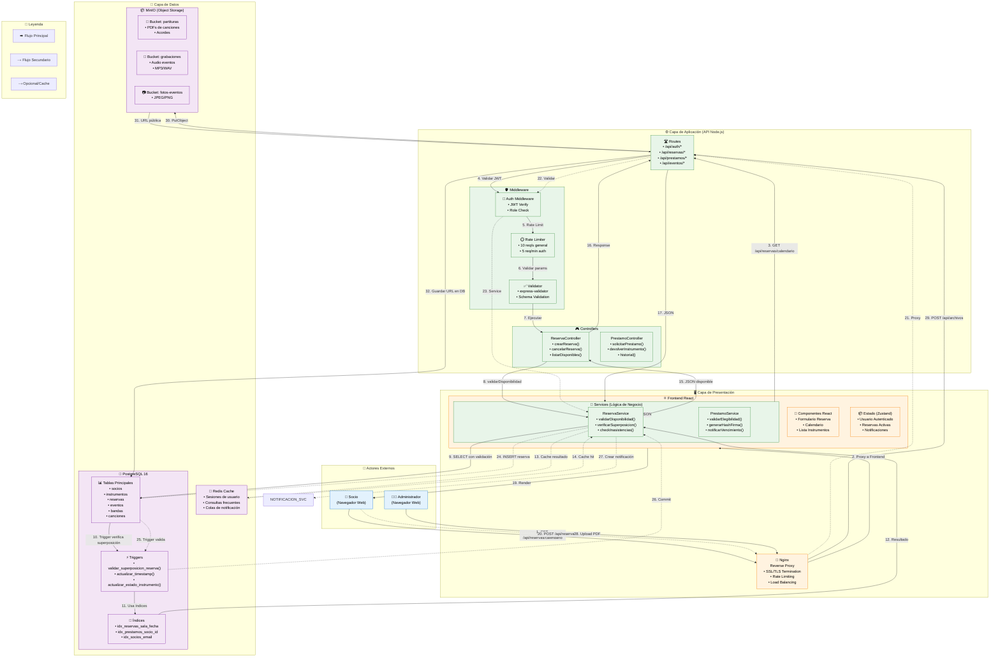
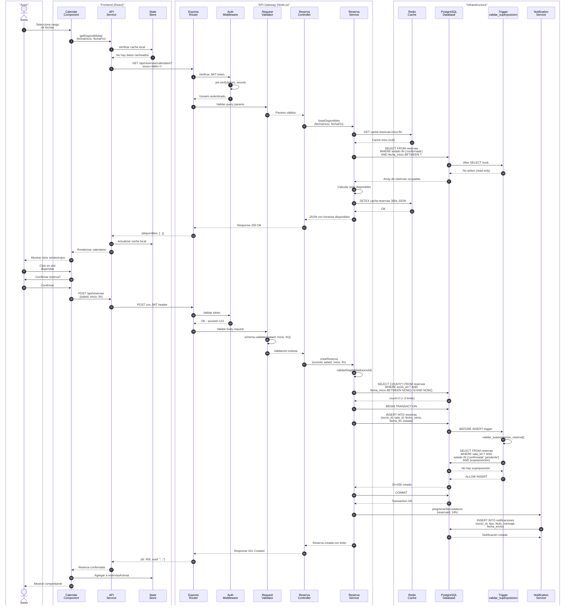
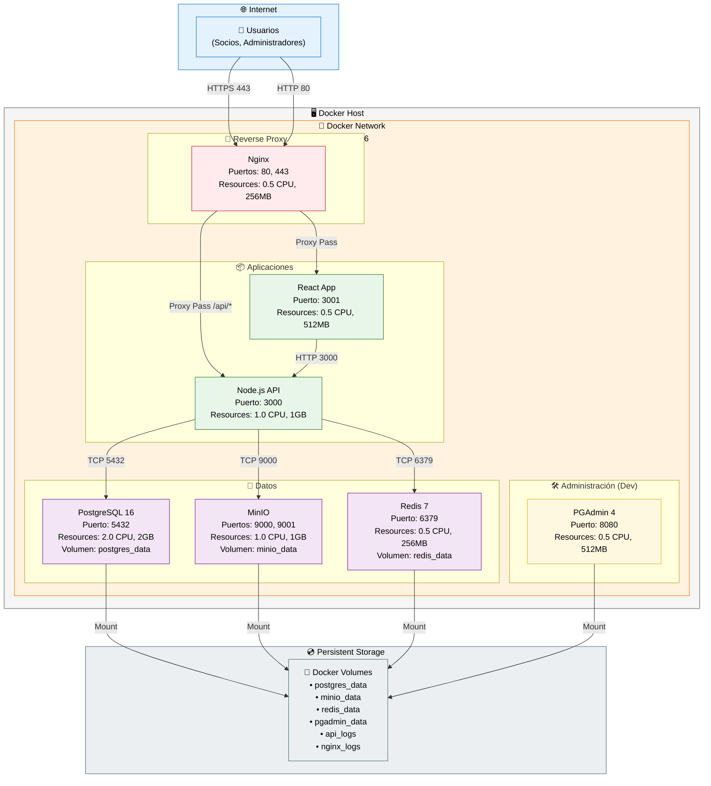

# Diagramas Mermaid - Sistema Club de Música

**Autores:** Juan Sandoval, Braulio Silva, Javier Herrada  
**Fecha:** Abril 2026  
**Versión:** 1.0

---

## Visualización de Diagramas

Este archivo contiene los diagramas en formato Mermaid.js. Puedes visualizarlos en:
- [Mermaid Live Editor](https://mermaid.live/)
- VS Code con la extensión "Markdown Preview Mermaid Support"
- GitHub/GitLab (soporte nativo)
- Convertir a PNG/SVG usando `mmdc` (Mermaid CLI)

---

## 1. Diagrama de Arquitectura de Contenedores

```mermaid
C4Context
    title Sistema Club de Música - Diagrama de Contenedores

    Person_Ext(socio, "Socio del Club", "Músico estudiante que usa el sistema")
    Person_Ext(admin, "Administrador", "Staff que gestiona instrumentos y eventos")
    Person_Ext(coordinador, "Coordinador", "Coordina audiciones y eventos")

    Boundary(b1, "Frontera del Sistema", "borderColor:#333") {
        Container(nginx, "Nginx", "Reverse Proxy", "Nginx<br/>Puerto 80/443", "Reverse proxy, SSL termination, rate limiting")
        
        Container_B(b2, "Aplicaciones", "borderColor:#444") {
            Container(frontend, "Frontend React", "SPA", "React 18 + TypeScript<br/>Puerto 3001", "Interfaz de usuario, calendario de reservas, gestión de préstamos")
            Container(api, "API Node.js", "REST API", "Node.js 20 + Express<br/>Puerto 3000", "Lógica de negocio, autenticación JWT, validaciones")
        }

        Container_B(b3, "Infraestructura de Datos", "borderColor:#444") {
            ContainerDb(postgres, "PostgreSQL", "RDBMS", "PostgreSQL 16<br/>Puerto 5432", "Datos persistentes: socios, instrumentos, reservas, eventos")
            Container(minio, "MinIO", "Object Storage", "S3-Compatible<br/>Puerto 9000", "Partituras PDF, grabaciones de audio, fotos de eventos")
            ContainerDb(redis, "Redis", "Cache", "Redis 7<br/>Puerto 6379", "Cache de consultas, sesiones de usuario, colas de notificaciones")
        }
    }

    Rel(socio, nginx, "HTTPS", "Solicita reservas, consulta instrumentos")
    Rel(admin, nginx, "HTTPS", "Gestiona préstamos, valida devoluciones")
    Rel(coordinador, nginx, "HTTPS", "Aprueba audiciones, crea eventos")

    Rel(nginx, frontend, "Proxy HTTP", "Sirve archivos estáticos")
    Rel(nginx, api, "Proxy HTTP", "/api/* requests")

    Rel(frontend, api, "HTTPS", "Peticiones REST/JSON")
    Rel(api, postgres, "TCP", "Consultas SQL con Sequelize ORM")
    Rel(api, minio, "S3 API", "Upload/download de archivos")
    Rel(api, redis, "TCP", "Cache de consultas frecuentes")

    UpdateRelStyle(socio, nginx, $offsetY="-40")
    UpdateRelStyle(admin, nginx, $offsetY="-20")
    UpdateRelStyle(coordinador, nginx, $offsetY="0")
    UpdateRelStyle(nginx, frontend, $offsetX="-30")
    UpdateRelStyle(nginx, api, $offsetX="30")
    UpdateRelStyle(frontend, api, $offsetY="-30")
    UpdateRelStyle(api, postgres, $offsetX="-40")
    UpdateRelStyle(api, minio, $offsetX="0", $offsetY="30")
    UpdateRelStyle(api, redis, $offsetX="40")

    UpdateLayoutConfig($c4ShapeInRow="3", $c4BoundaryInRow="1")
```

---

## 2. Diagrama Entidad-Relación (ERD)

Basado en `schema_musica.sql`

```mermaid
erDiagram
    %% ========================================================================
    %% TABLAS PRINCIPALES - SOCIOS E INSTRUMENTOS
    %% ========================================================================
    socios {
        integer id PK "Serial, Primary Key"
        uuid uuid UK "UUID único"
        varchar nombre_completo "150 caracteres"
        varchar email UK "100 caracteres, único"
        varchar telefono "20 caracteres"
        varchar instrumento_principal "50 caracteres"
        nivel_habilidad nivel_habilidad "Enum: principiante, intermedio, avanzado, profesional"
        date fecha_nacimiento ""
        timestamp fecha_registro "Default: NOW()"
        date fecha_vencimiento_membresia ""
        estado_socio estado "Enum: activo, bloqueado, suspendido, egresado"
        text observaciones ""
        timestamp created_at ""
        timestamp updated_at ""
    }

    instrumentos {
        integer id PK "Serial, Primary Key"
        uuid uuid UK "UUID único"
        varchar nombre "100 caracteres"
        varchar tipo "50 caracteres: Guitarra, Bajo, etc."
        varchar marca "50 caracteres"
        varchar modelo "50 caracteres"
        varchar numero_serie "50 caracteres"
        date fecha_adquisicion ""
        estado_instrumento estado "Enum: excelente, bueno, regular, dañado, en_mantenimiento, baja"
        varchar ubicacion "100 caracteres"
        decimal precio_compra "10,2"
        date fecha_ultima_mantenencion ""
        text observaciones ""
        timestamp created_at ""
        timestamp updated_at ""
    }

    %% ========================================================================
    %% TABLA DE PRÉSTAMOS (Relación entre Socios e Instrumentos)
    %% ========================================================================
    prestamos {
        integer id PK "Serial, Primary Key"
        uuid uuid UK "UUID único"
        integer socio_id FK "References socios(id)"
        integer instrumento_id FK "References instrumentos(id)"
        timestamp fecha_salida "Default: NOW()"
        timestamp fecha_devolucion "Nullable"
        timestamp fecha_limite "No nullable"
        estado_prestamo estado "Enum: activo, devuelto, vencido, reportado_dañado"
        text observaciones_salida ""
        text observaciones_devolucion ""
        integer responsable_registro FK "References socios(id)"
        timestamp created_at ""
        timestamp updated_at ""
    }

    %% ========================================================================
    %% TABLAS DE SALAS Y RESERVAS
    %% ========================================================================
    salas {
        integer id PK "Serial, Primary Key"
        uuid uuid UK "UUID único"
        varchar nombre "50 caracteres"
        tipo_sala tipo "Enum: cubiculo, salon_acustico, estudio_grabacion"
        integer capacidad "CHECK > 0"
        text equipamiento ""
        varchar estado "Default: activa"
        varchar ubicacion "100 caracteres"
        timestamp created_at ""
        timestamp updated_at ""
    }

    reservas {
        integer id PK "Serial, Primary Key"
        uuid uuid UK "UUID único"
        integer socio_id FK "References socios(id)"
        integer sala_id FK "References salas(id)"
        timestamp fecha_inicio "No nullable"
        timestamp fecha_fin "No nullable, > fecha_inicio"
        estado_reserva estado "Enum: confirmada, cancelada, completada, inasistencia, pendiente"
        text observaciones ""
        timestamp fecha_creacion "Default: NOW()"
        timestamp fecha_cancelacion "Nullable"
        integer cancelada_por FK "References socios(id)"
        text motivo_cancelacion ""
        timestamp created_at ""
        timestamp updated_at ""
    }

    %% ========================================================================
    %% TABLAS DE INASISTENCIAS Y NOTIFICACIONES
    %% ========================================================================
    inasistencias {
        integer id PK "Serial, Primary Key"
        integer socio_id FK "References socios(id) ON DELETE CASCADE"
        integer reserva_id FK "References reservas(id) ON DELETE SET NULL"
        date fecha_inasistencia "Default: CURRENT_DATE"
        boolean justificada "Default: FALSE"
        text justificacion ""
        timestamp created_at ""
    }

    notificaciones {
        integer id PK "Serial, Primary Key"
        uuid uuid UK "UUID único"
        integer socio_id FK "References socios(id)"
        varchar tipo "50 caracteres"
        varchar titulo "150 caracteres"
        text mensaje ""
        boolean leida "Default: FALSE"
        timestamp fecha_envio "Default: NOW()"
        timestamp fecha_lectura "Nullable"
        timestamp created_at ""
    }

    %% ========================================================================
    %% TABLAS DE EVENTOS, BANDAS Y SETLISTS
    %% ========================================================================
    eventos {
        integer id PK "Serial, Primary Key"
        uuid uuid UK "UUID único"
        varchar nombre "100 caracteres"
        text descripcion ""
        timestamp fecha "No nullable"
        varchar lugar "150 caracteres"
        integer responsable_id FK "References socios(id)"
        estado_evento estado "Enum: planificado, en_progreso, finalizado, cancelado"
        integer capacidad_maxima ""
        timestamp created_at ""
        timestamp updated_at ""
    }

    bandas {
        integer id PK "Serial, Primary Key"
        uuid uuid UK "UUID único"
        varchar nombre "100 caracteres"
        varchar genero_musical "50 caracteres"
        integer lider_id FK "References socios(id)"
        date fecha_formacion "Default: CURRENT_DATE"
        text descripcion ""
        varchar estado "Default: activa"
        timestamp created_at ""
        timestamp updated_at ""
    }

    banda_socios {
        integer id PK "Serial, Primary Key"
        integer banda_id FK "References bandas(id) ON DELETE CASCADE"
        integer socio_id FK "References socios(id) ON DELETE RESTRICT"
        rol_banda rol "Enum: fundador, integrante, ex_integrante"
        date fecha_ingreso "Default: CURRENT_DATE"
        date fecha_salida "Nullable"
        timestamp created_at ""
    }

    %% ========================================================================
    %% TABLAS DE REPERTORIO (CANCIONES Y SETLISTS)
    %% ========================================================================
    canciones {
        integer id PK "Serial, Primary Key"
        uuid uuid UK "UUID único"
        varchar titulo "150 caracteres"
        varchar artista "100 caracteres"
        varchar genero "50 caracteres"
        integer duracion_segundos "CHECK > 0"
        varchar tonalidad "10 caracteres"
        varchar partitura_url "500 caracteres"
        varchar grabacion_url "500 caracteres"
        text letra ""
        text acordes ""
        integer dificultad "CHECK 1-5"
        timestamp created_at ""
        timestamp updated_at ""
    }

    setlists {
        integer id PK "Serial, Primary Key"
        uuid uuid UK "UUID único"
        integer evento_id FK "References eventos(id) ON DELETE CASCADE"
        integer banda_id FK "References bandas(id) ON DELETE RESTRICT"
        integer cancion_id FK "References canciones(id) ON DELETE RESTRICT"
        integer orden "CHECK > 0, UNIQUE por evento/banda"
        text notas ""
        timestamp created_at ""
    }

    instrumento_requerido {
        integer id PK "Serial, Primary Key"
        integer cancion_id FK "References canciones(id) ON DELETE CASCADE"
        varchar tipo_instrumento "50 caracteres"
        text especificaciones ""
        boolean obligatorio "Default: TRUE"
        timestamp created_at ""
    }

    %% ========================================================================
    %% RELACIONES
    %% ========================================================================
    
    %% Socios -> Préstamos
    socios ||--o{ prestamos : "realiza (socio_id)"
    instrumentos ||--o{ prestamos : "es prestado en (instrumento_id)"
    
    %% Socios -> Reservas
    socios ||--o{ reservas : "reserva (socio_id)"
    salas ||--o{ reservas : "es reservada en (sala_id)"
    
    %% Socios -> Inasistencias
    socios ||--o{ inasistencias : "tiene (socio_id)"
    reservas ||--o| inasistencias : "genera (reserva_id)"
    
    %% Socios -> Notificaciones
    socios ||--o{ notificaciones : "recibe (socio_id)"
    
    %% Socios -> Bandas
    socios ||--o{ banda_socios : "pertenece (socio_id)"
    bandas ||--o{ banda_socios : "contiene (banda_id)"
    
    %% Socios -> Eventos
    socios ||--o{ eventos : "responsable (responsable_id)"
    
    %% Bandas -> Setlists
    bandas ||--o{ setlists : "presenta (banda_id)"
    eventos ||--o{ setlists : "incluye (evento_id)"
    canciones ||--o{ setlists : "contiene (cancion_id)"
    
    %% Canciones -> Instrumentos Requeridos
    canciones ||--o{ instrumento_requerido : "requiere (cancion_id)"

    %% ========================================================================
    %% ESTILOS
    %% ========================================================================
    classDef primary fill:#4a90d9,stroke:#2c5aa0,color:#fff
    classDef relation fill:#f9a825,stroke:#f57f17,color:#000
    classDef lookup fill:#66bb6a,stroke:#2e7d32,color:#fff
    
    class socios,instrumentos,salas,eventos,bandas,canciones primary
    class prestamos,reservas,banda_socios,setlists relation
    class inasistencias,notificaciones,Instrumento_requerido lookup
```



---

## 3. Diagrama de Flujo de Datos (Data Flow)



---

## 4. Diagrama de Secuencia Consolidado - Reserva de Sala



---

## 5. Diagrama de Despliegue (Deployment)



---

## Instrucciones de Uso

### Visualizar en Mermaid Live Editor

1. Copia cualquier diagrama de arriba
2. Ve a https://mermaid.live/
3. Pega el código en el editor
4. Exporta como PNG, SVG o PDF

### Convertir con Mermaid CLI

```bash
# Instalar Mermaid CLI
npm install -g @mermaid-js/mermaid-cli

# Convertir a PNG
mmdc -i diagrama.mmd -o diagrama.png -w 1920 -H 1080

# Convertir a SVG
mmdc -i diagrama.mmd -o diagrama.svg
```

### Incrustar en Markdown (GitHub/GitLab)

```markdown
```mermaid
[Pega el diagrama aquí]
```
```

---

*Documento de diagramas Mermaid para el Sistema del Club de Música*  
*Autores: Juan Sandoval, Braulio Silva, Javier Herrada*
