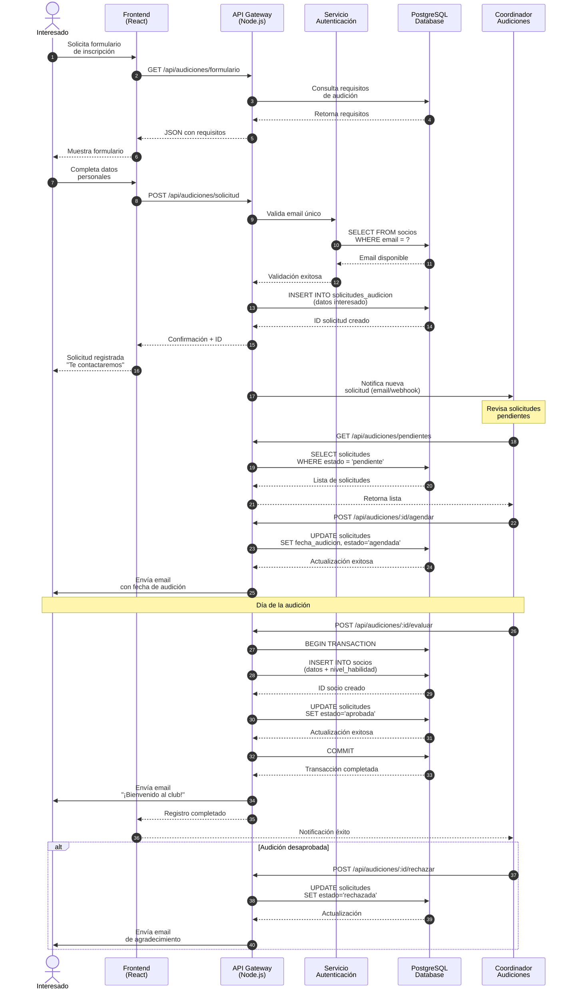
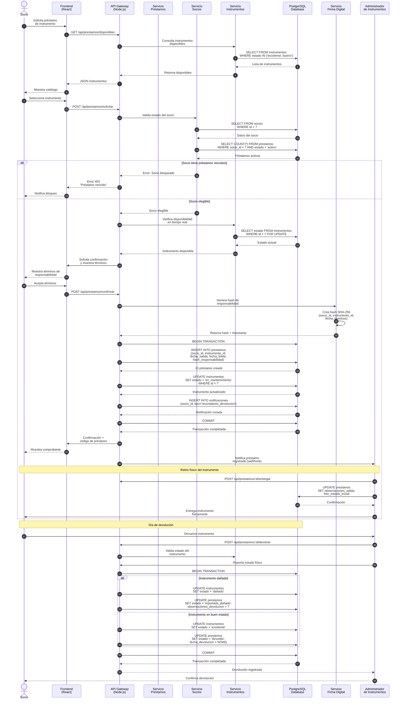
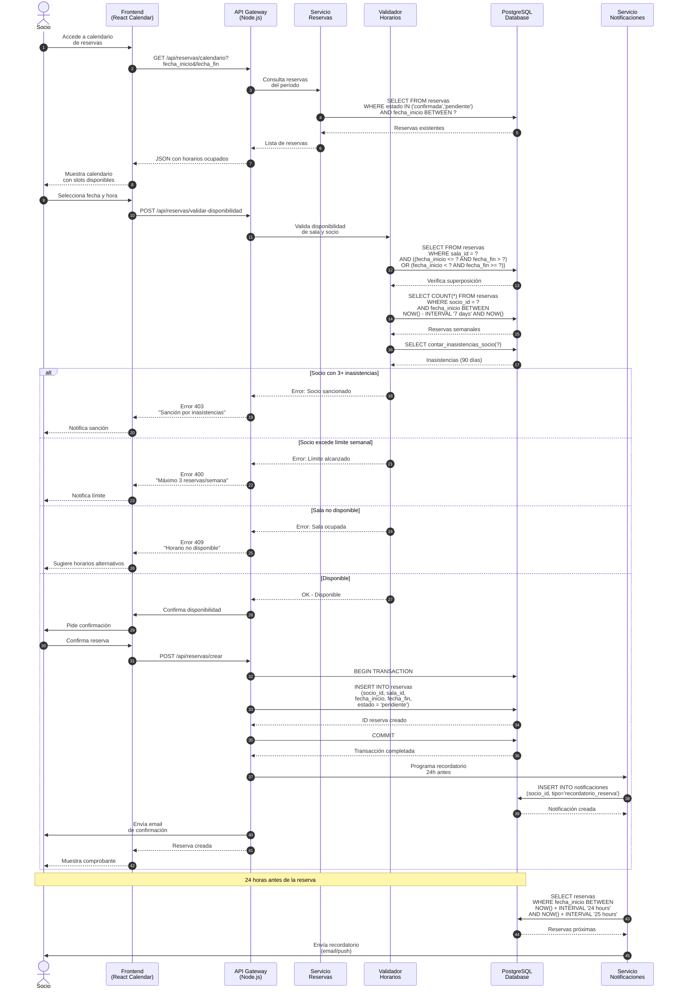
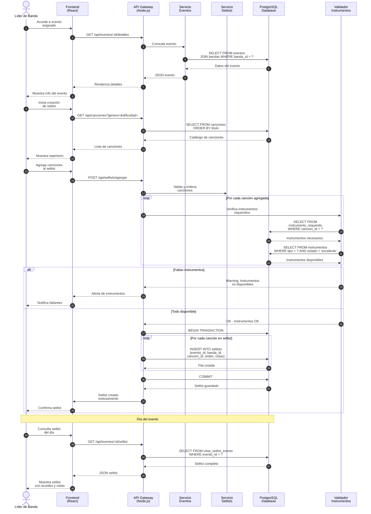

# Diagramas de Secuencia - Sistema Club de Música

**Autores:** Juan Sandoval, Braulio Silva, Javier Herrada  
**Fecha:** Abril 2026

---

## 1. Proceso de Audición y Registro de Nuevo Miembro

Este diagrama muestra el flujo completo desde que un interesado solicita unirse al club hasta que se completa su registro como socio activo.



### Descripción del Flujo

| Paso | Actor | Acción |
|------|-------|--------|
| 1-4 | Interesado | Solicita y completa formulario de inscripción |
| 5-8 | API + Auth | Valida que el email no esté registrado previamente |
| 9-12 | API + DB | Crea solicitud de audición en estado pendiente |
| 13-17 | Coordinador | Revisa solicitudes pendientes y agenda audición |
| 18-22 | Coordinador + API | Evalúa audición y crea socio si es aprobado |
| 23 | Sistema | Envía email de bienvenida con credenciales |

### Reglas de Negocio Aplicadas

- **RN-01:** El email debe ser único en el sistema
- **RN-02:** Toda audición debe ser agendada por el coordinador
- **RN-03:** El nivel de habilidad se determina en la audición
- **RN-04:** Socio aprobado recibe credenciales de acceso automáticamente

---

## 2. Flujo de Préstamo de Instrumento con Firma Digital de Responsabilidad

Este diagrama muestra el proceso de préstamo de un instrumento, incluyendo la validación de elegibilidad del socio, verificación del instrumento y la firma digital de responsabilidad.



### Descripción del Flujo

| Paso | Actor | Acción |
|------|-------|--------|
| 1-5 | Socio + API | Consulta instrumentos disponibles |
| 6-10 | API + Socios | Valida elegibilidad del socio (sin préstamos vencidos) |
| 11-14 | API + Instrumentos | Verifica disponibilidad en tiempo real con lock |
| 15-18 | Sistema | Genera hash SHA-256 como firma digital de responsabilidad |
| 19-25 | API + DB | Crea préstamo en transacción atómica |
| 26-28 | Admin + Socio | Entrega física con registro de estado inicial |
| 29-35 | Admin + API | Proceso de devolución con validación de estado |

### Componentes de la Firma Digital

```
hash_responsabilidad = SHA-256(
    socio_id ||
    instrumento_id ||
    fecha_salida ||
    fecha_limite ||
    terminos_version ||
    salt_secreto
)
```

### Reglas de Negocio Aplicadas

- **RN-01:** Socio con préstamo vencido no puede solicitar nuevos préstamos
- **RN-02:** El hash de responsabilidad se genera al momento de confirmar
- **RN-03:** El instrumento se marca como "en_mantenimiento" durante el préstamo
- **RN-04:** La devolución requiere validación física del administrador
- **RN-05:** Instrumento dañado genera reporte automático y bloqueo de socio

### Estructura del Hash de Responsabilidad

| Campo | Tipo | Descripción |
|-------|------|-------------|
| socio_id | UUID | Identificador único del socio |
| instrumento_id | UUID | Identificador único del instrumento |
| fecha_salida | TIMESTAMP | Fecha y hora exacta de salida |
| fecha_limite | TIMESTAMP | Fecha límite de devolución |
| terminos_version | VARCHAR | Versión de términos aceptados |
| salt_secreto | VARCHAR | Salt del sistema para integridad |

---

## 3. Flujo de Reserva de Sala con Validación de Disponibilidad



### Trigger de Base de Datos Aplicado

El trigger `trg_validar_superposicion_reserva` se ejecuta automáticamente:

```sql
-- Se activa antes de INSERT o UPDATE en reservas
CREATE TRIGGER trg_validar_superposicion_reserva
    BEFORE INSERT OR UPDATE ON reservas
    FOR EACH ROW EXECUTE FUNCTION validar_superposicion_reserva();
```

### Reglas de Negocio Aplicadas

- **RN-01:** Validación de superposición de horarios (trigger DB)
- **RN-02:** Máximo 3 reservas por socio por semana
- **RN-03:** Socio con 3+ inasistencias en 90 días está bloqueado
- **RN-04:** Recordatorio automático 24 horas antes
- **RN-05:** Reserva en estado "pendiente" hasta confirmación

---

## 4. Flujo de Creación de Setlist para Evento



---

## Leyenda de Símbolos

| Símbolo | Significado |
|---------|-------------|
| actor | Usuario externo al sistema |
| participant | Componente del sistema |
| solid arrow | Solicitud/llamada |
| dashed arrow | Respuesta |
| Note | Nota explicativa |
| alt/else | Condición condicional |
| loop | Iteración repetitiva |
| DB cylinder | Base de datos PostgreSQL |

---

*Documento de diagramas de secuencia para el Sistema del Club de Música*
